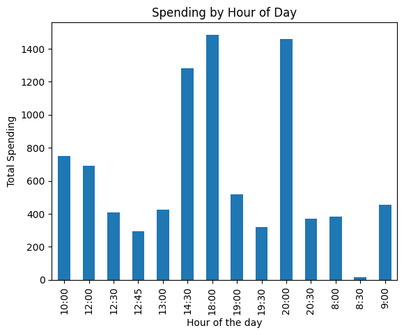

# Spending Analysis

This repository contains a Jupyter notebook I developed to analyse my personal spending data, providing insights into my financial transactions. For privacy reasons, the notebook is demonstrated with a synthetic dataset generated with the assistance of [OpenAI's ChatGPT](https://openai.com/). 

The notebook analyses various aspects such as total amount spent, spending per category, most common payment method, transaction count per payment method, most and least expensive purchases, daily spending patterns, spending over time, average daily spending per category and expenditure trend analysis with Linear Regression. 

To use the notebook with your own data, replace the 'spending.csv' file. This file should be a CSV with columns 'date', 'time', 'amount', 'category', and 'method'. 

Please note that the trends observed with the synthetic data may not reflect real-world spending habits. 

## Prerequisites

Ensure you have the following installed:

- [Python](https://www.python.org/downloads/)
- [Jupyter notebook](https://jupyter.org/install)
- [Pandas](https://pandas.pydata.org/pandas-docs/stable/getting_started/install.html)
- [Matplotlib](https://matplotlib.org/stable/users/installing.html)
- [NumPy](https://numpy.org/install/)
- [sklearn](https://scikit-learn.org/stable/install.html)

You can also install the above Python packages using pip:

```shell
pip install jupyter pandas matplotlib numpy scikit-learn
```

## Graphs and Plots

Below are the generated graphs and plots that visualize various aspects of the spending data:
1. **Total Amount Spent Per Category**

    
    
    This pie chart shows the proportion of total expenditure for each category. This is useful for understanding which categories are taking up the majority of your budget and could be potential areas for cost saving.

2. **Number of Debit and Credit Transactions per Category**

    
    
    This bar chart compares the number of transactions made using debit and credit cards for each category. It's beneficial for tracking payment methods, which can be useful for managing credit card rewards or avoiding overuse of credit.

3. **Spending over Time**

    
    
    This line graph illustrates the trend of total expenditure over time. It helps to visualize spending patterns and to identify any unusual spikes or drops in spending.

4. **Spending by Hour of the Day**

    
    
    This bar chart shows the total expenditure grouped by the hour of the day. It can reveal any spending habits related to specific times of day, which might be insightful for personal behavior analysis.

5. **Expenditure vs Time by Payment Method**

    
    
    This scatter plot depicts the amount of each transaction over time, differentiated by payment method. It provides insights into how spending habits differ between credit and debit card usage.

6. **Expenditure vs Time by Payment Method with Linear Regression**

    
    
    This scatter plot shows the expenditure over time, separated by payment method. It also includes a linear regression line that indicates the overall spending trend. The downward slope of the regression line suggests a decrease in overall expenditure over time, which is useful to understand long-term spending trends and to predict future spending.


## Feedback and Contributions

If you have any feedback, issues, or suggestions for improvements, feel free to open an issue or make a pull request. Contributions are welcome!

